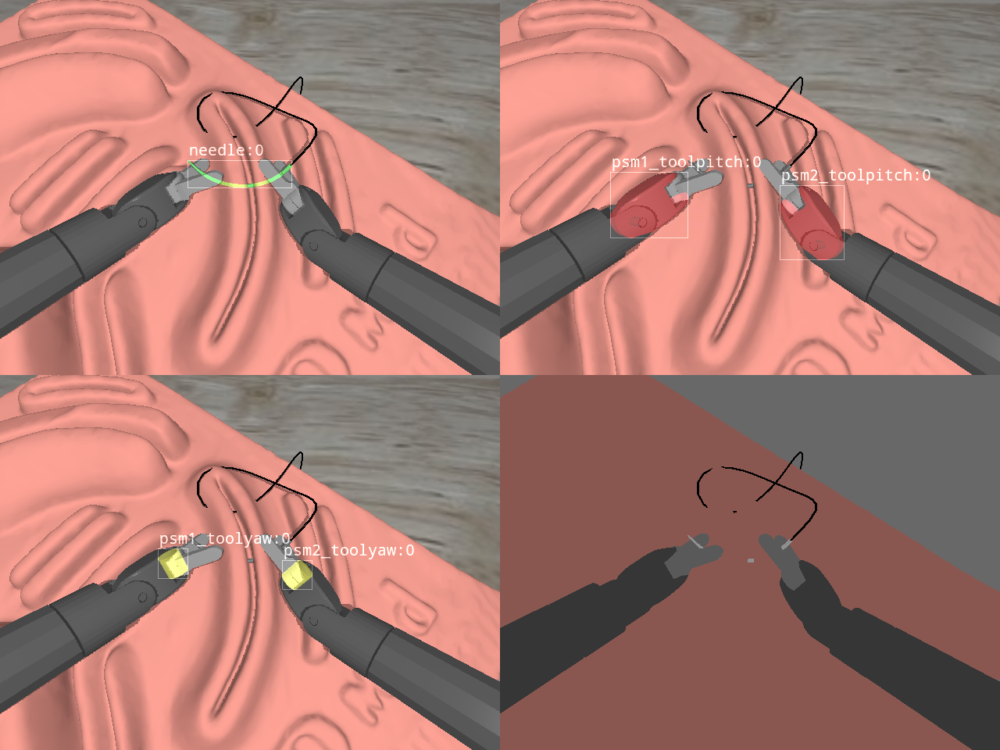

# Synthetic data generation of surgical instruments' 6D pose datasets​ 

Package to generate 6D pose datasets of surgical instruments. The package is based on the [Surgical Robotic challenge][SRC-github] simulation environment and the [BOP toolkit][BOP-github].

<p align="center">

</p>


Main functionalities:

1. Replaying of pre-recorded trajectories 
2. Recording of datasets in the BOP format.
3. Expressing the pose of AMBF objects with respect to the camera frame for computer vision applications.

# Getting started

The following code base will require Ubuntu 20.04, ROS noetic, [AMBF][ambf-github], and the [surgical robotics challenge][SRC-github] simulation environment. After obtaining all dependencies, first install `ambf6dpose` package with:

```bash
pip install -e .
```

and then install python dependencies with:

```bash
pip install -r requirements/requirements.txt
```

## Scripts
Scripts to collect and read data are found in `scripts/` folder.

**Replay instrumention motion**
Sample trajectories are available upon request.

```bash
python scripts/simple_replay.py single-replay --help
```

```
Usage: simple_replay.py single-replay [OPTIONS]

Options:
  --bag_path PATH            Path to bag file
  --percent_to_replay FLOAT  Path to bag file
  --ecm_pos FLOAT LIST       ECM joint position, specifid as a string of 4
                             float separated with a space,     e.g., '1.0 1.0
                             1.0 1.0'. If not provide current camera pose will
                             be used.
  -r                         Record images
  -o, --output_p DIRECTORY   Only required if record flag (-r) is set.
  --help                     Show this message and exit.
```

**Collection of image and pose data**
```bash
python scripts/collect_data.py --help
```

```bash
Usage: collect_data.py [OPTIONS]

  6D pose data collection script. Instructions: (1) Run ambf simulation (2)
  run recorded motions (3) run collection script.

Options:
  --path TEXT          Path to save dataset  [required]
  --sample_time FLOAT  Sample every n seconds
  --help               Show this message and exit.
```


## Troubleshooting:

* Ros topic for images are hardcoded on the [Rostopics.py](./ambf6dpose/DataCollection/Rostopics.py). If you are using a different topic names, the ROS sync client will not generate any data to be saved.

# Citation
If you find this work useful, please cite it as:

```bibtex

```

[//]: # (Important resources)

[SRC-github]: https://github.com/surgical-robotics-ai/surgical_robotics_challenge
[BOP-github]: https://github.com/thodan/bop_toolkit 
[ambf-github]: https://github.com/WPI-AIM/ambf/tree/ambf-2.0