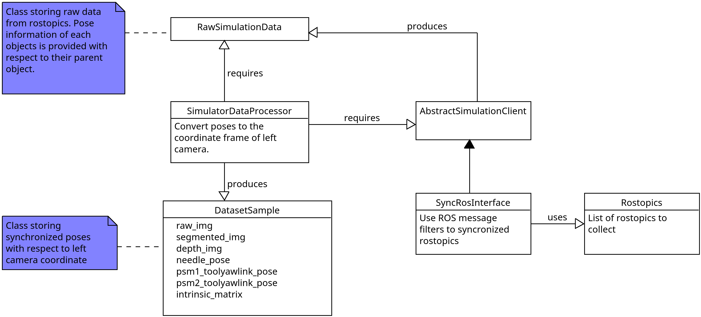

## Data generation pipeline

The data generation pipeline depends on a `SimulatorDataProcessor` that transforms the raw poses obtained from the ROS topics to the left camera coordinate frame. See the UML diagram below to see the classes involved in this process. The `DatasetSample` class has methods to visualize the objects' poses overlaid on the image plane. An example of these methods is shown at the bottom of `SimulatorDataProcesssor.py`.

## Adding additional data sources

To record the poses of new objects, the recording pipeline needs to be modified in two different locations: the configuration block of `Rostopics.py` and the member attributes of the `RawSimulationData` class. To test the script after adding the new data sources use the main function in `SimulatorDataProcessor.py`. Additionally, `scripts/testing_scripts/` have scripts to test if the Rostopics are sending data with a synchronized and an unsynchronized client. 

### Adding meshes of new objects to the dataset

Meshes of new objects need to be reformatted to `.ply` format, expressed in mm, and contain only triangular faces. To change the scale of a mesh to mm, open it in Meshlab and select `Filters > Normals, Curvatures and Orientation > Transform: Scale, normalize` and set the scale to 1000 with the uniform scaling option. After applying the scaling, you can get the object back to the screen by using the keyboard shortcut `Ctrl+h`. 

The mesh can be exported to `.ply` format by selecting `File > Export Mesh As...` and selecting the `.ply` format.

### Processing of new PSM meshes

Half of the vertices of the tool pitch link where decimated to reduce the file size. The decimation was done in Meshlab by selecting `Filters > Remeshing, Simplification and Reconstruction > Quadratic Edge Collapse Decimation`. Current file has 30,000 vertices. For more info read [here](https://gitbook.brown.edu/xromm/model-generation/xromm-cleaning-3d-models-with-meshlab) 

## Sample readers for DL applications

To load data into a neural network I would start from this script. `DatasetReader` behaves similarly to a torch `Dataset`, i.e., it is an iterable object and the data can be accessed via the `[]` operator. Make sure to check the `DatasetSample` and `DatasetReader` classes for more info.

## Resources

**Additional resources**
* https://gist.github.com/SeungBack/e71eac0faa52088e3038395fef684494 
* https://www.youtube.com/watch?v=6psAppbOOXM&ab_channel=MisterP.MeshLabTutorials
